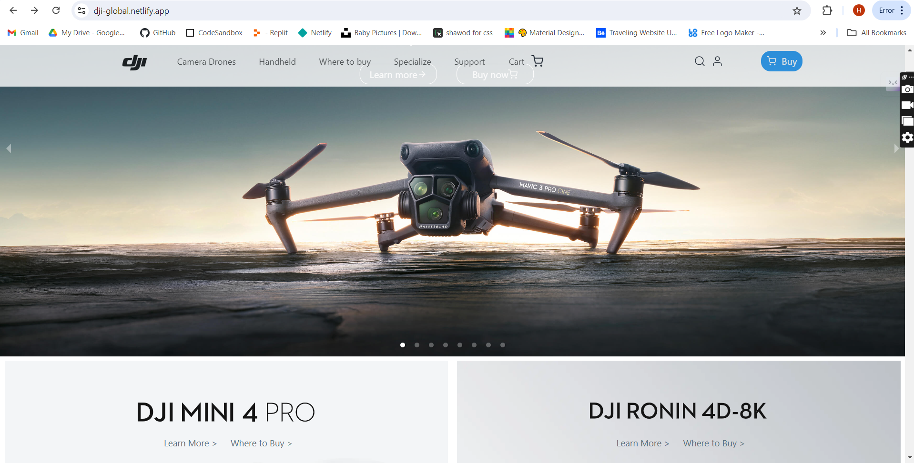
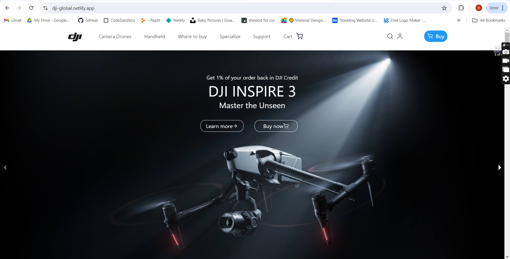
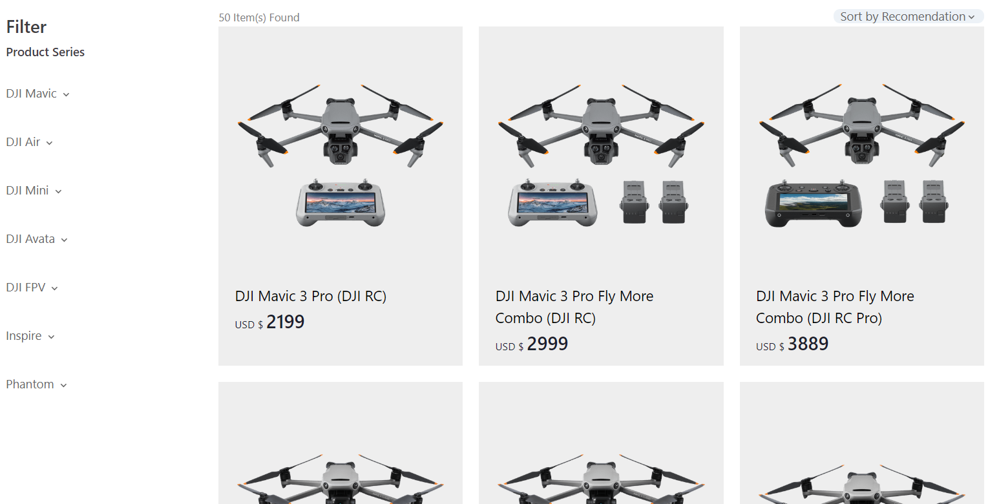
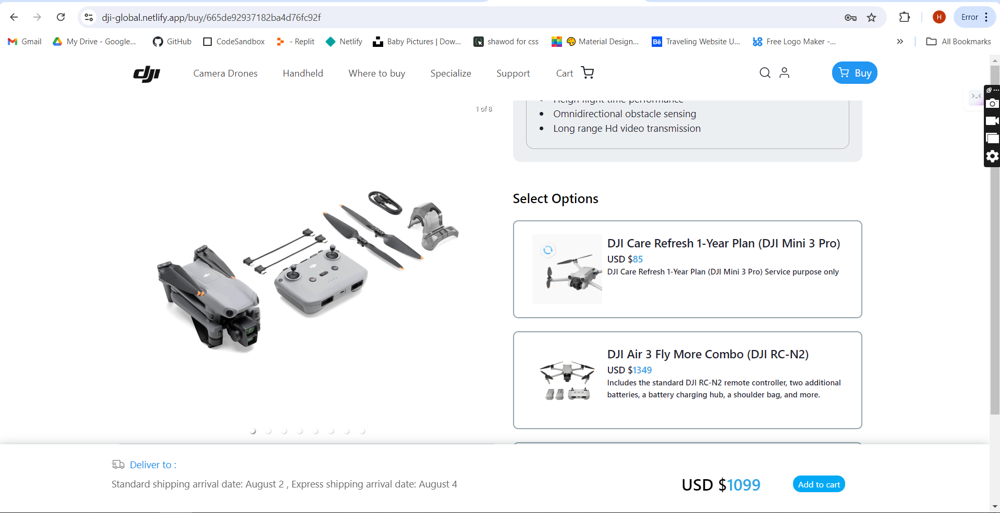
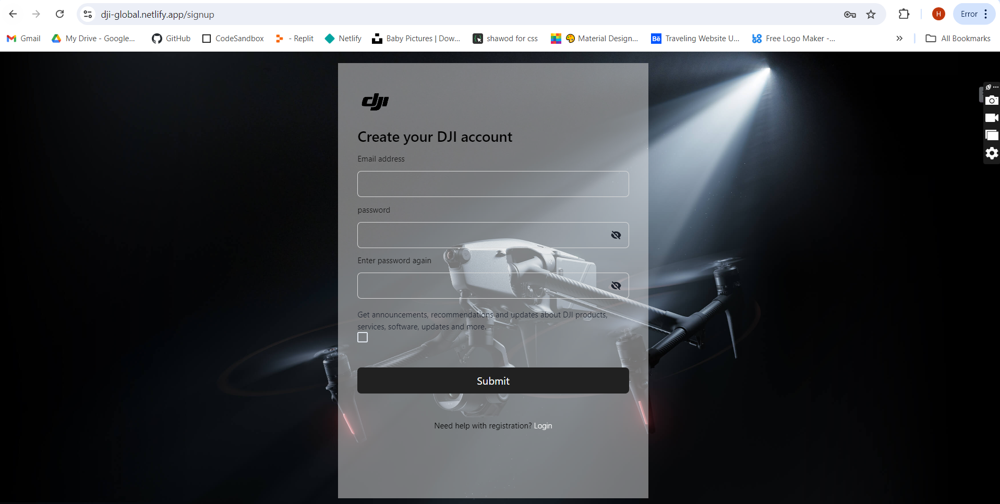
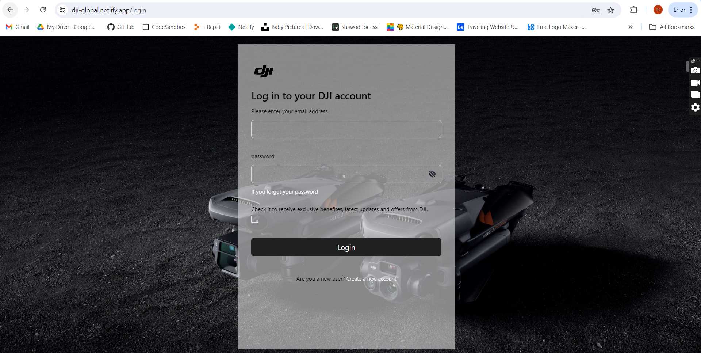
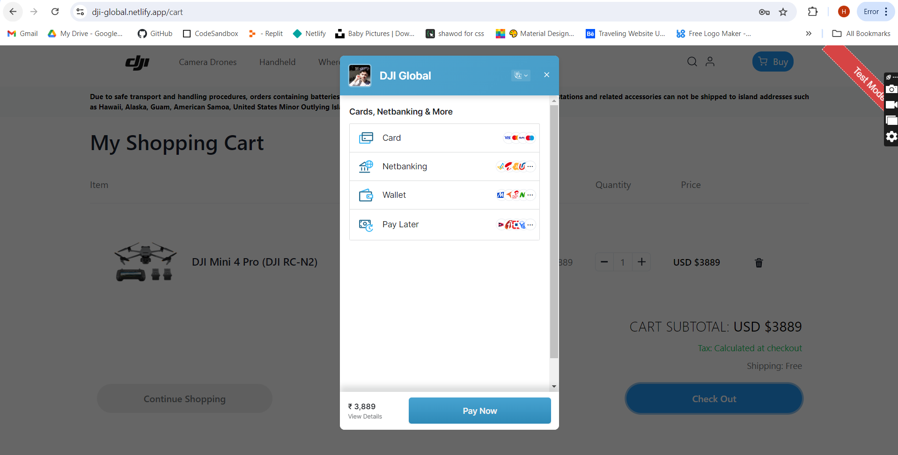
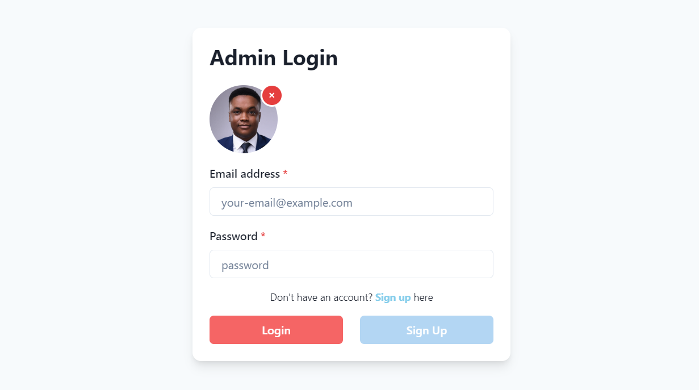
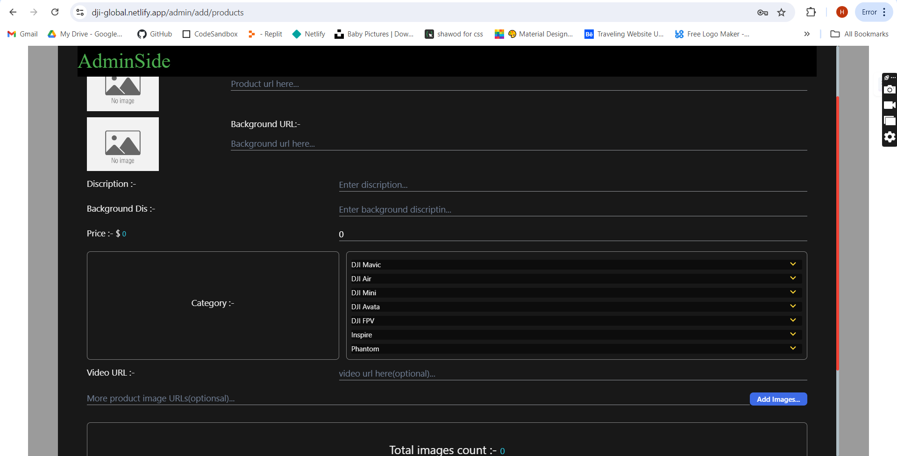

# DJI Official Website Clone

## Live Demo
[DJI Official Website Clone](https://dji-global.netlify.app/)

## Overview
This project is a fully functional clone of the DJI official website, built using the MERN stack (MongoDB, Express.js, React.js, Node.js). The clone replicates the same user interface and functionality as the original DJI website, including complete email authentication and payment processing.



## Features
- **User Authentication**: Secure email authentication with JWT.
- **Payment Processing**: Seamless integration with Razorpay for handling payments.
- **Identical UI**: Same look and feel as the original DJI website.
- **Product Management**: Add, edit, and delete products.
- **Cloud Storage**: Images are stored using Cloudinary.
- **Email Notifications**: Automated emails using Nodemailer and SMTP transport.
- **Responsive Design**: Mobile-friendly design using Chakra UI.

## Technologies Used
| Frontend  | Backend    | Other Tools               |
| --------- | ---------- | ------------------------- |
| React.js  | Node.js    | Cloudinary                |
| Chakra UI | Express.js | Razorpay                  |
| Axios     | MongoDB    | Netlify                   |
|           | CORS       | Render                    |
|           | JWT        | EJS                       |
|           | bcrypt     | Multer                    |
|           |            | Nodemailer SMTP transport |

## Installation

1. Clone the repository 
   ```sh
   git clone https://github.com/Harsh2004R/drone_site.git
   cd drone_site
   ```

2. Install dependencies for frontend 
   ```sh
    cd drone_site
    
    npm install
    ```
3. Start the Frontend live server
   ```sh
   npm run dev
   cd 
   ```

# Functionality
## Homepage

### Prototype Screenshots 👇


The homepage displays featured products and promotional banners, providing users with a quick overview of the latest DJI products.


## Product Listing

### Prototype Screenshots 👇


Users can browse through a wide range of products, each with detailed descriptions and high-quality images.


## Product Details

### Prototype Screenshots 👇


Detailed product information, including specifications, price, and user reviews.


## User Authentication

### Prototype Screenshots 👇

- **registration**



- **login**



Secure login and registration system with JWT-based authentication.


## Payment Processing

### Prototype Screenshots 👇


Seamless integration with Razorpay for secure payment processing.


## Admin Dashboard

### Prototype Screenshots 👇

- **Adin Auth**



- **Adin Panel**



Admin users can manage products, including adding new products, editing existing ones, and deleting products.


## Deployment

### Prototype Screenshots 👇


The project is deployed on Netlify(frontend) and Render(backend) for seamless access and performance.

## Contribution
Feel free to fork this repository and submit pull requests. For major changes, please open an issue first to discuss what you would like to change.

## License
This project is licensed under the MIT License.

